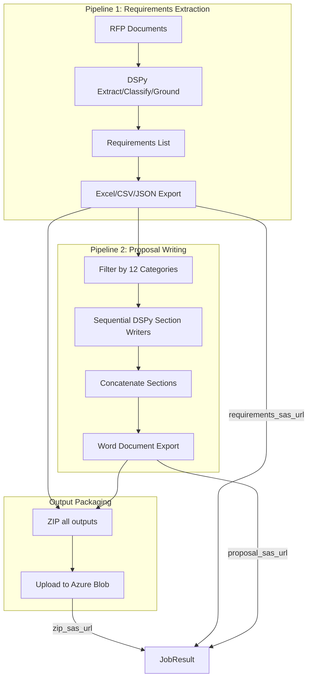

# Proposal Writing Pipeline Implementation

## Architecture Overview



## Key Files

| File | Purpose |
|------|---------|
| `app/src/proposal/signatures.py` | DSPy signatures for proposal writing |
| `app/src/proposal/modules.py` | DSPy modules (single-pass and two-stage) |
| `app/src/proposal/export_word.py` | Word document generation |
| `backend/prefect_flows/tasks.py` | Task implementations (called directly) |
| `backend/api/routes.py` | Pipeline runner (run_pipeline_direct) |
| `backend/api/models.py` | JobResult with all SAS URLs |

---

## 1. DSPy Pipeline Design (Two Approaches)

### Approach A: Single-Pass Section Writer (Default)

```python
# app/src/proposal/signatures.py
class WriteSectionSinglePass(dspy.Signature):
    """Write a proposal section addressing all requirements.
    
    Input: Category name, requirements JSON array, document structure context
    Output: Well-structured prose addressing each requirement
    """
    category: str = InputField()
    requirements_json: str = InputField()
    section_context: str = InputField()  # Part name + section position
    proposal_text: str = OutputField()
```

### Approach B: Two-Stage Writer (Higher Quality, Slower)

```python
class AnalyzeSectionThemes(dspy.Signature):
    """Extract key themes and compliance points from requirements."""
    category: str = InputField()
    requirements_json: str = InputField()
    themes_json: str = OutputField()  # Key themes to address

class DraftSectionFromThemes(dspy.Signature):
    """Write proposal section based on themes and requirements."""
    category: str = InputField()
    themes_json: str = InputField()
    requirements_json: str = InputField()
    proposal_text: str = OutputField()
```

---

## 2. Category Processing Order

The proposal is organized into 4 parts with 12 categories:

```python
PROPOSAL_SECTIONS = {
    "Part 1: The Promise (BLUF)": [
        "Technical Approach & Capability",
        "Schedule & Milestones",
    ],
    "Part 2: The Solution (Customer Focus)": [
        "Performance & Deliverables",
        "Operations & Sustainment",
        "Customer Service & Communications",
    ],
    "Part 3: The People (Low Risk)": [
        "Personnel & Qualifications",
        "Training & Workforce Development",
        "Management & Staffing",
    ],
    "Part 4: The Safety Net (Compliance)": [
        "Quality Assurance",
        "Security (Personnel & Facility)",
        "Risk Management & Oversight Authority",
        "Flowdowns & Subcontracting",
    ],
}
```

---

## 3. Pipeline Integration

The backend runs the full pipeline directly in `run_pipeline_direct()`:

```python
def run_pipeline_direct(job_id: str, job_data: JobSubmission):
    # Step 1: Download files
    downloaded_files = download_files_task.fn(blob_urls, job_id)
    
    # Step 2: Run DSPy extraction
    requirements = run_dspy_pipeline_task.fn(opportunity_id, downloaded_files)
    
    # Step 3: Generate matrix outputs
    matrix_result = generate_and_upload_task.fn(requirements, job_id, ...)
    # Returns: requirements_sas_url, local_paths (xlsx, csv, json)
    
    # Step 4: Generate proposal (if requested)
    if job_data.generate_proposal:
        proposal_result = generate_proposal_task.fn(
        requirements=requirements,
            job_id=job_id,
            opportunity_id=job_data.opportunity_id,
            use_two_stage=job_data.use_two_stage_writer
        )
        # Returns: proposal_sas_url, local_path (docx)
    
    # Step 5: ZIP all outputs
    zip_sas_url = zip_outputs_task.fn(
        matrix_paths=matrix_result["local_paths"],
        proposal_path=proposal_result["local_path"],
        job_id=job_id,
        ...
    )
    
    # Store results
    jobs_db[job_id]["requirements_sas_url"] = matrix_result["requirements_sas_url"]
    jobs_db[job_id]["proposal_sas_url"] = proposal_result["proposal_sas_url"]
    jobs_db[job_id]["zip_sas_url"] = zip_sas_url
```

---

## 4. Word Document Export

Using `python-docx` in `app/src/proposal/export_word.py`:

```python
def export_proposal_to_word(sections: List[Dict], path: Path, title: str) -> Path:
    """
    Export proposal sections to Word document.
    
    - Title page with document title
    - Part headings: Heading 1 style
    - Section headings (category names): Heading 2 style  
    - Content: Normal style, 12pt Times New Roman
    - Page breaks between parts
    """
    doc = Document()
    doc.add_heading(title, level=0)
    
    current_part = None
    for section in sections:
        if section["part"] != current_part:
            current_part = section["part"]
            doc.add_page_break()
            doc.add_heading(current_part, level=1)
        
            doc.add_heading(section["category"], level=2)
            doc.add_paragraph(section["content"])
    
    doc.save(path)
    return path
```

---

## 5. API Response Model

```python
class JobResult(BaseModel):
    job_id: str
    status: JobStatus
    requirements_sas_url: Optional[str] = None  # Excel matrix
    proposal_sas_url: Optional[str] = None      # Word document
    zip_sas_url: Optional[str] = None           # All outputs bundled
    file_count: Optional[int] = None            # Number of requirements
    error_message: Optional[str] = None
    created_at: datetime
    completed_at: Optional[datetime] = None
```

---

## 6. Frontend Download UI

The frontend shows three download options when results are ready:

```python
# Download buttons
if results.get("zip_sas_url"):
    st.markdown(f'<a href="{zip_sas_url}">📦 Download All (ZIP)</a>')

if results.get("requirements_sas_url"):
    st.markdown(f'<a href="{requirements_sas_url}">📊 Compliance Matrix (Excel)</a>')

if results.get("proposal_sas_url"):
    st.markdown(f'<a href="{proposal_sas_url}">📝 Proposal Document (Word)</a>')
```

---

## 7. Output Files

Each completed job produces:

| File | Description |
|------|-------------|
| `{name}.matrix.xlsx` | Compliance matrix with all requirements |
| `{name}.matrix.csv` | CSV export of requirements |
| `{name}.requirements.json` | Raw JSON data |
| `{name}.proposal.docx` | Generated proposal document |
| `{name}.outputs.zip` | All of the above bundled |

All files are uploaded to Azure Blob Storage with 24-hour SAS URL expiry.

---

## 8. Configuration Options

### Job Submission Parameters

```python
class JobSubmission(BaseModel):
    opportunity_id: str
    custom_filename: Optional[str] = None
    use_highergov: bool = False
    blob_urls: Optional[List[str]] = None
    generate_proposal: bool = True           # Enable proposal generation
    use_two_stage_writer: bool = False       # Higher quality, slower
```

### Writer Selection

- **Single-pass (default)**: Fast, good quality
- **Two-stage**: Analyzes themes first, then drafts. Higher quality but 2x LLM calls

---

## Implementation Status

✅ DSPy signatures and modules created
✅ Word document export implemented
✅ Task functions implemented (tasks.py)
✅ Pipeline runner integrated (routes.py)
✅ ZIP bundling implemented
✅ API models updated with zip_sas_url
✅ Frontend download UI updated
