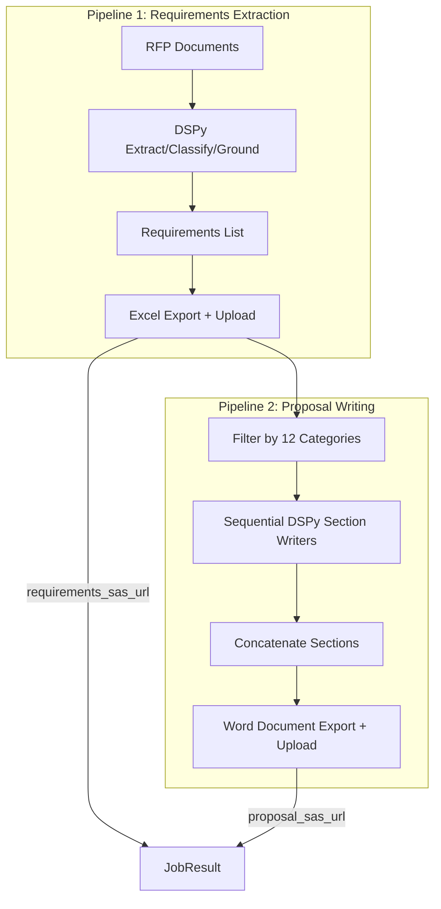

# Proposal Writing Pipeline Implementation

## Architecture Overview



## Key Files to Create/Modify

| File | Purpose |

|------|---------|

| `app/src/proposal/signatures.py` | DSPy signatures for proposal writing |

| `app/src/proposal/modules.py` | DSPy modules (2 approaches) |

| `app/src/proposal/export_word.py` | Word document generation |

| `backend/prefect_flows/proposal_flow.py` | Proposal generation Prefect tasks |

| `backend/prefect_flows/extraction_flow.py` | Modify to chain Pipeline 2 |

| `backend/api/models.py` | Update JobResult to include proposal URL |

---

## 1. DSPy Pipeline Design (Two Approaches)

### Approach A: Single-Pass Section Writer (Primary)

```python
# app/src/proposal/signatures.py
class WriteSectionSinglePass(dspy.Signature):
    """Write a proposal section addressing all requirements.
    
    Input: Category name, requirements JSON array, document structure context
    Output: Well-structured prose addressing each requirement
    """
    category: str = InputField()
    requirements_json: str = InputField()
    section_context: str = InputField()  # Part name + section position
    proposal_text: str = OutputField()
```

### Approach B: Two-Stage Writer (Alternative)

```python
class AnalyzeSectionThemes(dspy.Signature):
    """Extract key themes and compliance points from requirements."""
    category: str = InputField()
    requirements_json: str = InputField()
    themes_json: str = OutputField()  # Key themes to address

class DraftSectionFromThemes(dspy.Signature):
    """Write proposal section based on themes and requirements."""
    category: str = InputField()
    themes_json: str = InputField()
    requirements_json: str = InputField()
    proposal_text: str = OutputField()
```

---

## 2. Category Processing Order

```python
PROPOSAL_SECTIONS = {
    "Part 1: The Promise (BLUF)": [
        "Technical Approach & Capability",
        "Schedule & Milestones",
    ],
    "Part 2: The Solution (Customer Focus)": [
        "Performance & Deliverables",
        "Operations & Sustainment",
        "Customer Service & Communications",
    ],
    "Part 3: The People (Low Risk)": [
        "Personnel & Qualifications",
        "Training & Workforce Development",
        "Management & Staffing",
    ],
    "Part 4: The Safety Net (Compliance)": [
        "Quality Assurance",
        "Security (Personnel & Facility)",
        "Risk Management & Oversight Authority",
        "Flowdowns & Subcontracting",
    ],
}
```

---

## 3. Proposal Flow Integration

Modify [`backend/prefect_flows/extraction_flow.py`](backend/prefect_flows/extraction_flow.py) to chain the proposal generation:

```python
@flow(name="extract-and-generate-proposal")
def extraction_flow(...) -> Dict[str, Any]:
    # Existing steps 1-3...
    requirements = run_dspy_pipeline_task(...)
    requirements_sas_url = generate_and_upload_task(...)
    
    # NEW: Step 4 - Generate proposal document
    proposal_sas_url = generate_proposal_task(
        requirements=requirements,
        job_id=job_id,
        opportunity_id=opportunity_id,
        custom_filename=custom_filename
    )
    
    return {
        "job_id": job_id,
        "status": "completed",
        "requirements_sas_url": requirements_sas_url,
        "proposal_sas_url": proposal_sas_url,  # NEW
        "file_count": len(requirements)
    }
```

---

## 4. Word Document Export

Using `python-docx` in [`app/src/proposal/export_word.py`](app/src/proposal/export_word.py):

```python
def export_proposal_to_word(sections: List[Dict], path: Path) -> Path:
    """
    Export proposal sections to Word document.
    
    - Part headings: Heading 1 style
    - Section headings (category names): Heading 2 style  
    - Content: Normal style, 12pt Times New Roman
    - Newline separator between sections
    """
    doc = Document()
    # Configure styles...
    for part_name, part_sections in sections:
        doc.add_heading(part_name, level=1)
        for section in part_sections:
            doc.add_heading(section["category"], level=2)
            doc.add_paragraph(section["content"])
    doc.save(path)
```

---

## 5. Updated API Response Model

Modify [`backend/api/models.py`](backend/api/models.py):

```python
class JobResult(BaseModel):
    job_id: str
    status: JobStatus
    requirements_sas_url: Optional[str] = None  # Renamed
    proposal_sas_url: Optional[str] = None      # NEW
    file_count: Optional[int] = None
    error_message: Optional[str] = None
    created_at: datetime
    completed_at: Optional[datetime] = None
```

---

## 6. Implementation Steps

1. Create proposal DSPy signatures and modules with both approaches
2. Create Word document export utility
3. Add new Prefect task for proposal generation
4. Modify extraction flow to chain proposal generation
5. Update API models and routes for dual output URLs
6. Update frontend to display both download links